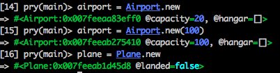
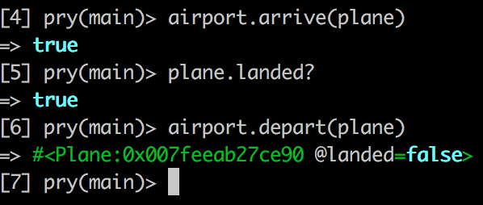

# Airport Challenge

## Challenge

We have a request from a client to write the software to control the flow of planes at an airport. The planes can land and take off provided that the weather is sunny. Occasionally it may be stormy, in which case no planes can land or take off.  Here are the user stories that we worked out in collaboration with the client:

### User Stories
```
As an air traffic controller
So I can get passengers to a destination
I want to instruct a plane to land at an airport

As an air traffic controller
So I can get passengers on the way to their destination
I want to instruct a plane to take off from an airport and confirm that it is no longer in the airport

As an air traffic controller
To ensure safety
I want to prevent takeoff when weather is stormy

As an air traffic controller
To ensure safety
I want to prevent landing when weather is stormy

As an air traffic controller
To ensure safety
I want to prevent landing when the airport is full

As the system designer
So that the software can be used for many different airports
I would like a default airport capacity that can be overridden as appropriate
```

### Approach

In order to solve this problem, I created three classes; Airport, Plane and Weather.
The Airport class is responsible for the the landing, departing and storing of a collection of planes.  

The Plane class has minimal responsibility but provides details of a plane's current status (#flying?).  

The Weather class randomly generates stormy weather which has the effect of closing the airport and stopping any planes from departing or taking off.

### Installation

1.  Enter the following at the command line

 `git clone https://github.com/bwk103/airport_challenge.git`

2.  If not already installed, install Bundler using the following command:

  `gem install bundler`

3. Enter the following command to install gems:

  `bundle install`

4. Enter IRB (or your REPL of choice):

  `irb`

5. Require 'airport.rb' and 'plane.rb' using the following command (if within the project directory):
`require'./lib/airport.rb'`

### Using the System

#### Creating Airports & Planes




#### Landing/Takeoff and Checking Plane Status




 ### Running Tests

 The code includes unit and feature tests using the rspec test framework.  In order to run the tests, simply execute the following at the command line:

`rspec`
